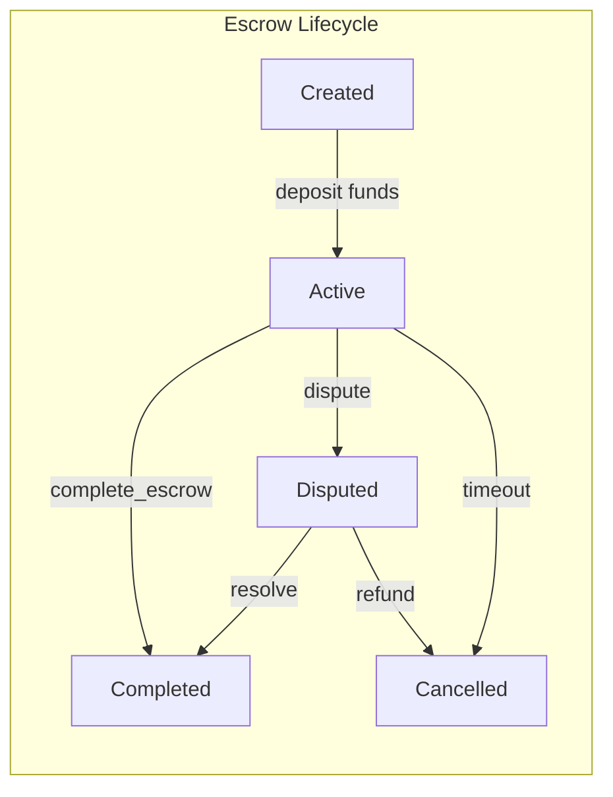

# Escrow Module — Architecture



## Module Structure

```
escrow/
├── escrow.move          # Core escrow logic
├── escrow_test.move     # Unit tests
└── init.move            # Module initialization
```

## Key Functions

| Function | Visibility | Purpose |
|----------|-----------|---------|
| `create_escrow` | `public` | Create a new escrow with locked funds |
| `complete_escrow` | `public` | Release funds to recipient (shown in full below) |
| `dispute_escrow` | `public` | Escalate to dispute resolution |
| `refund_escrow` | `public` | Return funds to depositor |
| `cancel_expired` | `public` | Timed-out escrows auto-cancel |

## Data Flow

1. **Client** calls `create_escrow(buyer, seller, amount, agent)`
2. **Funds** are transferred to contract address
3. **Escrow** transitions to `Active` state with `ESCROW_TIMEOUT_DAYS` expiry
4. **Freelancer** submits work off-chain
5. **Either party** calls `complete_escrow` to release funds
6. **System** validates state + amount → transfers → emits event

## Security Model

- All state transitions are one-way (no going back to `Active`)
- Amount verification prevents partial release attacks
- `public_transfer` used instead of `transfer` for cross-module compatibility
- Reentrancy prevented by Move's linear type system + `transfer::public_transfer`
